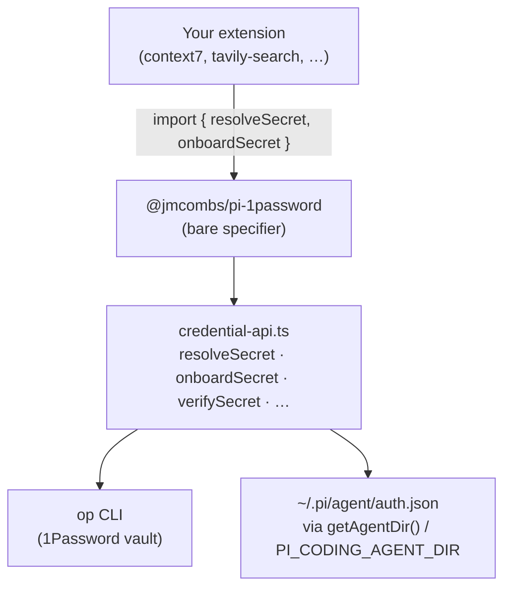
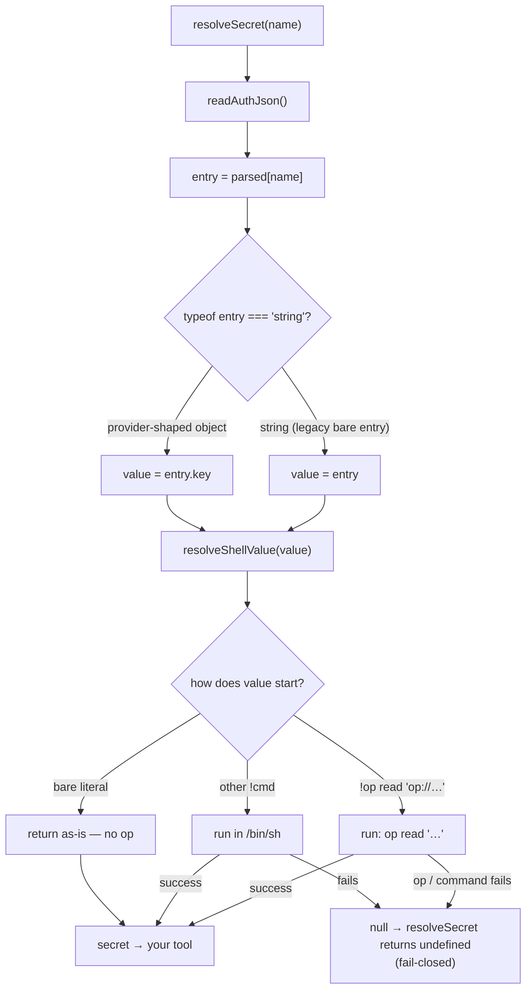

# Integrating `@jmcombs/pi-1password` into your extension

A step-by-step guide to adding 1Password-backed credentials to a pi extension.
You wire up **two functions** — `resolveSecret` (resolve a key on use) and
`onboardSecret` (collect a key when it is missing) — and the 1Password extension
owns everything else: the vault picker, the availability branch, the masked
manual-entry fallback, `auth.json` writes, and the startup unlock.

This guide is the developer companion to the API reference
([`API.md`](./API.md)), which documents every export in detail. Read this to
adopt the API; read `API.md` for exact signatures and return shapes.

- [Overview](#overview)
- [When to use it](#when-to-use-it)
- [Architecture](#architecture)
- [Step-by-step integration](#step-by-step-integration)
- [Worked example — context7](#worked-example--context7)
- [The onboarding flow](#the-onboarding-flow)
- [The resolve sequence](#the-resolve-sequence)
- [Portability — pi and oh-my-pi](#portability--pi-and-oh-my-pi)
- [Troubleshooting](#troubleshooting)
- [Advanced and reference](#advanced-and-reference)

## Overview

The `@jmcombs/pi-1password` package is the **credential authority** for this
monorepo. Instead of reaching into pi internals —
`AuthStorage`, `ModelRuntime`, `readStoredCredential`, all removed in pi
0.80.8 — your extension declares `@jmcombs/pi-1password` as a hard dependency and
**imports** its functions. The dependency auto-installs with your extension, so
the API is always importable at runtime.

Two functions carry the whole adoption path:

| Function | You call it… | It does… |
| --- | --- | --- |
| `resolveSecret(name)` | every time a tool needs the key | reads `auth.json` fresh, resolves the stored entry (a literal key **or** an `!op read 'op://…'` reference), returns the secret or `undefined` |
| `onboardSecret(ctx, { name, label })` | from a `<slug>_setup` command, and on a resolve miss | runs the interactive onboarding UI (vault picker when `op` is available, masked manual entry otherwise), writes the entry, verifies it |

Everything else in the API — `changeSecret`, `verifySecret`, `deleteSecret`,
`is1PasswordAvailable` — is internal/advanced. No shipped consumer calls those
four directly; they are covered briefly in [Advanced and
reference](#advanced-and-reference).

## When to use it

Use this API whenever your extension needs a **user-provided secret** — a
third-party API key, a token — that must:

- resolve fresh on each use (so rotating the key in 1Password takes effect
  immediately, with no restart);
- never appear in the LLM-visible context (entry happens entirely in the TUI);
- keep working for users who already have a literal key or an `!op read`
  reference in `~/.pi/agent/auth.json` (existing entries resolve unchanged).

If your extension has no user secret (it's a status line, a notifier, a tool
that talks only to the local machine), you don't need this API.

## Architecture

Your extension imports the credential API by its **bare package specifier**.
That package wraps the `op` CLI and the agent's `auth.json`; it resolves the
agent directory through pi's `getAgentDir()`, which honors `PI_CODING_AGENT_DIR`.



Because pi loads each extension in its own jiti sandbox with `moduleCache:
false`, your `import` is a **fresh module instance** — but every function
is stateless (it re-reads `auth.json` and re-runs `op` on each call), so it
behaves identically to the host extension. There is no shared session object to
initialize.

## Step-by-step integration

### 1. Add the dependency

Install `@jmcombs/pi-1password` as a regular dependency — this records the
current version in your `package.json` automatically:

```bash
npm install @jmcombs/pi-1password
```

It must be a hard **`dependencies`** entry, never `peerDependencies`: pi
installs extensions with `--omit=peer`, so a peer would not be installed and
the import would fail. Leave your pi-runtime peers (`@earendil-works/*`) at
`"*"` — do not pin a version floor there.

### 2. Import the two functions

```ts
import { resolveSecret, onboardSecret } from "@jmcombs/pi-1password";
```

### 3. Wire an onboarding command

Register a `<slug>_setup` command (the `_setup` naming convention) that
delegates to `onboardSecret` and surfaces the returned message. Use your
extension's brand slug as `<slug>` and your logical key name as `name`:

```ts
pi.registerCommand("example_setup", {
  description: "Set up or update your Example API key (never shown to the agent).",
  handler: async (_args, ctx) => {
    const result = await onboardSecret(ctx, { name: "example", label: "Example" });
    ctx.ui.notify(result.message, result.ok ? "info" : "warning");
  },
});
```

`onboardSecret` owns the entire availability branch — you never call
`is1PasswordAvailable` yourself. The returned `message` is human-only and safe to
surface; it never contains the entered value or a resolved secret.

### 4. Wire tool auth = resolve-on-use with auto-onboard on miss

In each tool's `execute()`, resolve the key; if it's missing, run onboarding and
re-resolve. This preserves the "prompt on first use" experience without a
separate setup step:

```ts
async execute(_toolCallId, params, signal, _onUpdate, ctx) {
  let apiKey = await resolveSecret("example");
  if (!apiKey) {
    const r = await onboardSecret(ctx, { name: "example", label: "Example" });
    if (r.ok) {
      apiKey = await resolveSecret("example");
    }
  }
  if (!apiKey) {
    return {
      content: [{ type: "text", text: "Cancelled: no Example API key provided." }],
      details: { error: "missing_api_key" },
    };
  }

  // …use `apiKey` to call the third-party service…
}
```

The same `ctx` works in both the command handler and the tool `execute()`,
because `onboardSecret` only needs `Pick<ExtensionContext, "ui">`.

### 5. Test

- Typecheck and lint your package.
- Smoke-test that the extension loads and registers its command + tools.
- With a key present, confirm `resolveSecret` returns it; with none, confirm the
  tool triggers onboarding. (A live `op read` against a real vault reference
  needs an authenticated 1Password session and is a manual check.)

## Worked example — context7

`context7` is the reference consumer. The excerpts below are quoted from
[`packages/context7/index.ts`](../../packages/context7/index.ts) at the line
numbers current at the time of writing; open the file to see them in context.

**Import (line 20).** Only the two functions are pulled in:

```ts
import { onboardSecret, resolveSecret } from "@jmcombs/pi-1password";
```

**The `context7_setup` command (lines 120–126).** A thin wrapper over
`onboardSecret` that notifies the outcome:

```ts
pi.registerCommand("context7_setup", {
  description: "Set up or update your Context7 API key (never shown to the agent).",
  handler: async (_args, ctx) => {
    const result = await onboardSecret(ctx, { name: "context7", label: "Context7" });
    ctx.ui.notify(result.message, result.ok ? "info" : "warning");
  },
});
```

**Resolve-with-auto-onboard in `context7_search` (lines 137–155).** The tool
resolves on use and falls back to onboarding on a miss:

```ts
async execute(_toolCallId, params, signal, _onUpdate, ctx) {
  let apiKey = await resolveSecret("context7");
  if (!apiKey) {
    const r = await onboardSecret(ctx, { name: "context7", label: "Context7" });
    if (r.ok) {
      apiKey = await resolveSecret("context7");
    }
  }
  if (!apiKey) {
    return {
      content: [
        {
          type: "text",
          text: "Search cancelled: no Context7 API key provided.",
        },
      ],
      details: { error: "missing_api_key" },
    };
  }
  // …call the Context7 API with `Authorization: Bearer ${apiKey}`…
}
```

The second tool, `context7_get_docs`, uses the **identical** block — that
resolve-then-onboard shape is the whole pattern. The header JSDoc (lines 1–17 of
the same file) is a good prose summary of the credential flow to mirror in your
own extension's doc comment.

## The onboarding flow

`onboardSecret` runs the flow below (source:
[`packages/1password/credential-api.ts`](../../packages/1password/credential-api.ts),
`onboardSecret`). Note two details of the flow: the
**existing-key gate runs first** (before any availability check), and the
available branch offers **three** sources, not just the vault picker.

```mermaid
flowchart TD
    A["onboardSecret(ctx, { name, label })"] --> B{"parsed[name] already set<br/>and overwrite not requested?"}
    B -- "Yes" --> C{"Replace it / Keep the current key"}
    C -- "Keep or Esc" --> Z["No-op:<br/>'Kept your existing key. Nothing changed.'"]
    C -- "Replace it" --> D
    B -- "No" --> D{"is1PasswordAvailable()?<br/>(op installed AND configured)"}
    D -- "Available" --> E["Source menu — 3 options"]
    E --> E1["Locate in 1Password<br/>(live vault → item → field picker)"]
    E --> E2["Type or paste the key<br/>(masked literal entry)"]
    E --> E3["Enter a 1Password reference<br/>(validated op://vault/item/field)"]
    D -- "Not available" --> F["Masked manual entry<br/>+ 'install 1Password CLI' nudge"]
    E1 --> G["writeProviderAuthEntry (file-locked)"]
    E2 --> G
    E3 --> G
    F --> G
    G --> H["Post-save verify (verifySecret)"]
    H --> I["{ ok, message }"]
```



Both vault-backed sources (browse, or a typed `op://` reference) are stored as
`!op read '<ref>'`; the two literal sources store the key verbatim in a
provider-shaped entry. Either way, a **post-save verify** resolves the entry once
to confirm it works before reporting success.

> A **simplified** version of this diagram (collapsing the three sources and
> omitting the existing-key gate) ships in
> [`packages/context7/README.md`](../../packages/context7/README.md) for
> end-users. Use the full flow above when you need the real branch behavior.

## The resolve sequence

`resolveSecret(name)` reads `auth.json` fresh, picks the value out of the stored
entry (handling **both** a provider-shaped object and a legacy bare string), and
hands it to the shared shell resolver. That resolver has **three** sub-branches —
only the `!op read` one actually runs `op`.

Source:
[`packages/1password/credential-api.ts`](../../packages/1password/credential-api.ts)
(`resolveSecret`) and
[`packages/1password/index.ts`](../../packages/1password/index.ts)
(`resolveShellValue`).



The key takeaways: `op read` is **not** unconditional (a bare literal never
touches `op`), and any failure fails **closed** — `resolveShellValue` returns
`null` and `resolveSecret` returns `undefined`, never the unresolved raw string.

## Portability — pi and oh-my-pi

The credential API is **runtime-agnostic**: `resolveSecret` and `onboardSecret`
work identically on pi and on oh-my-pi, and existing `auth.json` keys resolve on
both. For *writing* extensions that are omp-compatible (feature-detecting host
APIs and the like), see [`CONTRIBUTING.md`](../../CONTRIBUTING.md).

## Troubleshooting

| Symptom | Cause | Fix |
| --- | --- | --- |
| `resolveSecret` returns `undefined` for an `!op read` entry | `op` is not signed in / the account is locked | The startup **warm-on-load** runs one `op read` to trigger the biometric unlock. If you hit a tool before that lands, unlock 1Password (Touch ID) and retry; the next `resolveSecret` succeeds. |
| `resolveSecret` returns `undefined` for a key you thought you set | No entry under that logical `name` in `auth.json` | Run `<slug>_setup`, or confirm the key name matches what your tool resolves (e.g. `resolveSecret("context7")` needs a `"context7"` entry). |
| Onboarding never shows the vault picker, only manual entry | `is1PasswordAvailable()` is `false` — `op` isn't installed or no account is configured | Install the 1Password CLI and configure an account (service-account token, Connect env, or `op account list`), then re-run onboarding. |
| First tool call of a session prompts for Touch ID | Expected — the **warm-on-load** unlock triggers the single OS-level prompt so later calls don't | Approve it once at startup; the biometric session then covers the rest of the session. |

## Advanced and reference

Four more functions exist for advanced/internal use. **No shipped consumer calls
them directly** — the two-function path above is all you normally need. See
[`API.md`](./API.md) for full signatures and semantics:

- `is1PasswordAvailable()` — whether `op` is installed **and** configured.
  `onboardSecret` already calls this internally to pick its branch.
- `changeSecret(ctx, opts)` — `onboardSecret` with `overwrite: true`.
- `verifySecret(name)` — reports **whether** a key resolves, without returning
  the value. Used by the post-save verify step.
- `deleteSecret(name)` — removes an entry under the file lock.

For exact types, return shapes, the storage shape, and fail-closed
semantics, read the full reference: [`API.md`](./API.md).
