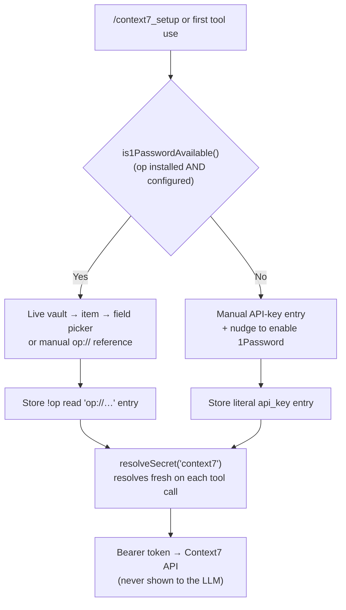

<div align="center">
  
  <br>
  <a href="https://www.npmjs.com/package/@jmcombs/pi-context7"></a>
  <a href="https://www.npmjs.com/package/@jmcombs/pi-context7"></a>
  <a href="https://opensource.org/licenses/MIT"></a>
  <a href="https://github.com/jmcombs/pi-extensions/stargazers"></a>
  <a href="https://github.com/jmcombs/pi-extensions/issues"></a>
  <a href="https://github.com/sponsors/jmcombs"></a>
</div>

# @jmcombs/pi-context7

Real-time documentation for the Pi coding agent via [Context7](https://context7.com). Gives the agent access to up-to-date, version-aware docs and code examples without polluting context with outdated information.

## What's New — 1Password credential integration

Context7 now handles your API key through the [`@jmcombs/pi-1password`](https://www.npmjs.com/package/@jmcombs/pi-1password) credential API, which installs automatically as a dependency. What this means for you:

- **Onboarding branches on 1Password availability.** If the `op` CLI is installed and an account is configured, `/context7_setup` opens a live **vault → item → field picker** (or lets you type an `op://…` reference) and stores it as a `!op read '…'` entry that resolves fresh on every use. If `op` is not available, it falls back to **manual API-key entry** and nudges you to enable the 1Password extension for vault integration.
- **Existing keys keep working.** Any Context7 key already in `~/.pi/agent/auth.json` — a literal key or an `!op read` reference — continues to resolve unchanged. No migration action is required.
- **The key is never exposed to the model.** Entry happens entirely in the TUI, and only the resolved value is used to call the Context7 API.
- **Startup warm-up.** With the [`@jmcombs/pi-1password`](https://www.npmjs.com/package/@jmcombs/pi-1password) extension installed and enabled, a one-time `op read` runs at session startup, so the 1Password biometric unlock prompt lands once and later key resolves are silent.



## Quick Start

Get better library documentation in your agent in under a minute.

1. Install the extension:

   ```bash
   pi install npm:@jmcombs/pi-context7
   ```

2. Configure your Context7 API key:

   ```
   /context7_setup
   ```

   The command opens the onboarding flow above — a 1Password vault picker when `op` is available, or a secure manual-entry prompt otherwise. The value is never visible to the LLM.

After setup, just ask the agent for documentation normally:

- "How do I set up Row Level Security in Supabase?"
- "Show me how to use server actions in Next.js 15"
- "What's the current recommended way to do authentication in tRPC?"

The agent will automatically use the Context7 tools to fetch fresh, high-quality documentation and code snippets.

## How It Works

This extension registers two tools:

- `context7_search` — Finds the correct Context7 library ID for a programming language, framework, or library.
- `context7_get_docs` — Retrieves detailed, version-specific documentation and real code examples for that library.

Both tools resolve the key through `resolveSecret("context7")` from `@jmcombs/pi-1password`, reading `~/.pi/agent/auth.json` fresh on each call (a literal key or an `!op read` reference). If no key is stored, the tool automatically runs onboarding (the availability branch above), then re-resolves — preserving the "prompt on first use" experience. The key is never leaked into the LLM context.

## /context7_setup

Run this command to configure (or update) your Context7 API key at any time:

```
/context7_setup
```

It delegates to the `@jmcombs/pi-1password` onboarding flow, which:

- Branches on 1Password availability — vault picker (`op://` reference) when `op` is configured, secure manual entry otherwise.
- Stores the value in `~/.pi/agent/auth.json` (`0600`), never exposing it to the model.
- Reports the outcome as a status notification.

To rotate an existing key, install and enable the [`@jmcombs/pi-1password`](https://www.npmjs.com/package/@jmcombs/pi-1password) extension and re-run onboarding through it, or edit `auth.json` directly.

## After Setup

Just talk to the agent naturally. It will use Context7 automatically when it needs current documentation for a library.

Examples of good prompts:

- "Find the Context7 library for Prisma and show me how to do relations"
- "What's the recommended way to handle file uploads in Supabase right now?"
- "Give me examples of using the new React 19 use() hook"

## Checking Status

`/context7_setup` will not silently overwrite an existing key — if one is already stored it reports that and leaves it in place. To rotate a key, remove the existing `context7` entry from `~/.pi/agent/auth.json` (or update it through the `@jmcombs/pi-1password` extension), then run `/context7_setup` again.

## Development

This package lives in the [pi-extensions monorepo](https://github.com/jmcombs/pi-extensions).

```bash
# From the repo root
npm ci
npm run check
npm run test -- --run packages/context7
```

To test changes locally:

```bash
pi -e ./packages/context7
```
