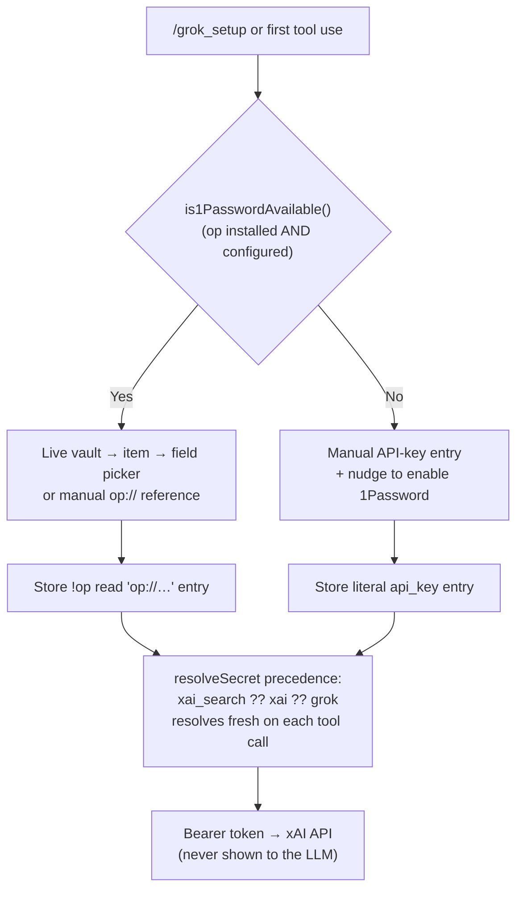

# @jmcombs/pi-grok-search

<div align="center">
  
  <br>
  <a href="https://www.npmjs.com/package/@jmcombs/pi-grok-search"></a>
  <a href="https://www.npmjs.com/package/@jmcombs/pi-grok-search"></a>
  <a href="https://opensource.org/licenses/MIT"></a>
</div>

A [Pi coding agent](https://pi.dev) extension that adds real-time web search via the
[xAI Grok Agent Tools API](https://docs.x.ai/docs/guides/tools/overview).

## What's New — 1Password credential integration

Grok search now handles your xAI API key through the
[`@jmcombs/pi-1password`](https://www.npmjs.com/package/@jmcombs/pi-1password) credential
API, which installs automatically as a dependency. What this means for you:

- **Onboarding branches on 1Password availability.** If the `op` CLI is installed and an
  account is configured, `/grok_setup` opens a live **vault → item → field picker** (or
  lets you type an `op://…` reference) and stores it as a `!op read '…'` entry that
  resolves fresh on every use. If `op` is not available, it falls back to **manual
  API-key entry** and nudges you to enable the 1Password extension for vault integration.
- **Existing keys keep working.** Any `xai_search`, `xai`, or `grok` key already in
  `~/.pi/agent/auth.json` — a literal key or an `!op read` reference — continues to
  resolve unchanged. No migration action is required.
- **The key is never exposed to the model.** Entry happens entirely in the TUI, and only
  the resolved value is used to call the xAI API.
- **Enable 1Password for vault integration and startup unlock.** Install and enable the
  [`@jmcombs/pi-1password`](https://www.npmjs.com/package/@jmcombs/pi-1password) extension:
  it makes the vault picker available during onboarding and runs a one-time `op read` at
  session startup, so the biometric unlock prompt lands once.



> `/grok_setup` writes the **`grok`** id, so it never overwrites the shared real
> `xai` model-provider key.

## Install

```bash
# Globally (recommended)
pi install npm:@jmcombs/pi-grok-search

# For a single session, without installing
pi -e npm:@jmcombs/pi-grok-search
```

An xAI API key is required. [Sign up at x.ai](https://x.ai) to get one, then configure it
with `/grok_setup` (or one of the methods below).

## What It Adds

- **Tool**: `grok_search` — performs a web search using the xAI Grok Agent Tools API to
  get real-time information from the internet. The tool is callable by the LLM whenever it
  needs current information from the public web.
- **Command**: `/grok_setup` — runs the `@jmcombs/pi-1password` onboarding flow to save
  (or update) your Grok / xAI key. The input is never visible to the LLM.

## Configuration

The `grok_search` tool resolves the key through `@jmcombs/pi-1password` in this
precedence, reading `~/.pi/agent/auth.json` fresh on each call:

1. `resolveSecret("xai_search")` — a **dedicated** Grok search key, if you keep one
   separate. **Preferred.**
2. `resolveSecret("xai")` — the **real xAI model-provider key**, reused as-is. Grok search
   never overwrites this key; it only reads it.
3. `resolveSecret("grok")` — the id `/grok_setup` writes when you onboard a key here.

Each entry may be a literal key or an `!op read 'op://…'` reference. If none resolves, the
tool automatically runs onboarding (the availability branch above) on first use, then
re-resolves — preserving the "prompt on first use" experience.

### Option 1 — `/grok_setup` (recommended)

Run the command and follow the flow:

```
/grok_setup
```

- When the `op` CLI is available, pick your key from the live vault picker (or paste an
  `op://vault/item/field` reference); it is stored as a `!op read '…'` entry under the
  `grok` id that resolves fresh on every use.
- When `op` is not available, enter the key on a masked prompt; it is stored as a literal
  `api_key` entry under the `grok` id.

Either way the value is written to `~/.pi/agent/auth.json` (`0600`) and never shown to the
model. The `grok` id is written so your shared `xai` provider key stays untouched.

### Option 2 — edit `~/.pi/agent/auth.json` directly

The stored entry is provider-shaped. Any of these resolve (highest precedence first):

#### Dedicated key (`xai_search`)

```json
{
  "xai_search": {
    "type": "api_key",
    "key": "xai-..."
  }
}
```

#### Reuse your existing xAI provider key (`xai`)

```json
{
  "xai": {
    "type": "api_key",
    "key": "xai-..."
  }
}
```

#### Onboarding-written key (`grok`)

```json
{
  "grok": {
    "type": "api_key",
    "key": "xai-..."
  }
}
```

#### Shell-resolved key (1Password)

```json
{
  "xai_search": {
    "type": "api_key",
    "key": "!op read 'op://Personal/xai_search/credential'"
  }
}
```

#### Shell-resolved key (macOS Keychain)

```json
{
  "xai_search": {
    "type": "api_key",
    "key": "!security find-generic-password -ws xai_search"
  }
}
```

The `!`-prefixed value is executed by your shell at lookup time, so no secret is
ever stored on disk in plaintext.

## Behavior Notes

- Uses the current xAI Responses + Agent Tools API (`web_search` tool).
- The tool honors Pi's abort signal — pressing **Esc** during a search cancels the
  HTTP request.
- If the API key is missing the tool returns a result guiding you to `/grok_setup`
  instead of throwing.
- 401 / 429 / other non-2xx responses from xAI surface as tool results (with status and
  a helpful hint) rather than throwing. Recoverable errors are reported through the tool's
  `content` so the agent can guide you, never via a returned `isError` (which pi ignores).

## Requirements

- Pi `>= 0.80.8` (credentials via the `@jmcombs/pi-1password` API and `ExtensionAPI`)
- Node `>= 22.0.0`
- An xAI API key
- Optional: the `op` (1Password) CLI for vault-backed onboarding and startup unlock

## Development

This package lives in the [pi-extensions monorepo](https://github.com/jmcombs/pi-extensions).

```bash
# From the repo root
npm ci
npm run check       # full quality gate

# Try local changes against a real pi session
pi -e ./packages/grok-search
```

The smoke test in `index.test.ts` does **not** mock the xAI API; it only
verifies registration shape. Real end-to-end behavior is exercised via `pi -e`.

## License

[MIT](./LICENSE) © Jeremy Combs
