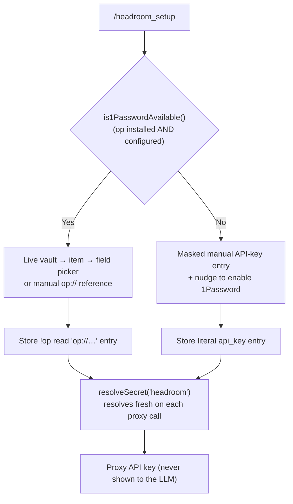

<div align="center">
  
  <br>
  <a href="https://www.npmjs.com/package/@jmcombs/pi-headroom"></a>
  <a href="https://www.npmjs.com/package/@jmcombs/pi-headroom"></a>
  <a href="https://opensource.org/licenses/MIT"></a>
  <a href="https://github.com/jmcombs/pi-extensions/stargazers"></a>
  <a href="https://github.com/jmcombs/pi-extensions/issues"></a>
  <a href="https://github.com/sponsors/jmcombs"></a>
</div>

# @jmcombs/pi-headroom

> Context-compression for the [Pi coding agent](https://pi.dev). It compresses the
> **whole conversation** before each LLM call through a local
> [Headroom](https://www.npmjs.com/package/headroom-ai) proxy, lets the model
> recover any detail that lossy compression elided, and degrades to **pure
> passthrough** whenever the proxy is unreachable.

Long agent sessions accumulate bulky tool output — file dumps, logs, search
results — that stays in context turn after turn and quietly inflates token cost.
Headroom crushes the **stale** parts of the conversation while protecting the
recent turns, so the model keeps the context it is actively using and sheds the
weight it is not. Every elision is reversible: the model can call
`headroom_retrieve` to pull back the full original on demand.

## Requirement: the Headroom Python proxy

The npm `headroom-ai` package is a thin HTTP client; the compression engine is a
**local Python proxy that you run and manage yourself**. This extension never
starts, stops, or installs it — it only health-checks it and reports its state.
Install the proxy once into a virtualenv:

```bash
python3 -m venv ~/.headroom-venv
~/.headroom-venv/bin/pip install "headroom-ai[proxy]"
```

> The `[proxy]` extra pulls in `onnxruntime` + `magika` (no PyTorch).

Then run the proxy (default endpoint `http://127.0.0.1:8787`):

```bash
~/.headroom-venv/bin/headroom proxy --port 8787
```

Confirm it is healthy:

```bash
curl -s http://127.0.0.1:8787/health   # → {"status":"healthy","version":"0.27.0",...}
```

If the proxy is **not** running, the extension stays fully usable: it emits a
single non-fatal notice at session start and runs in passthrough mode (no
compression, no added latency). See [Graceful degradation](#graceful-degradation).

## Install

```bash
# Globally (recommended)
pi install npm:@jmcombs/pi-headroom

# For a single session, without installing
pi -e ./packages/headroom
```

See the [Pi packages documentation](https://pi.dev/docs/packages) for git, local
path, project-scoped install, and filtering options.

## What's New — 1Password credential integration

Headroom's optional proxy API key is now handled through the
[`@jmcombs/pi-1password`](https://www.npmjs.com/package/@jmcombs/pi-1password)
credential API, which installs automatically as a dependency. What this means for you:

- **Onboarding branches on 1Password availability.** If the `op` CLI is installed
  and an account is configured, `/headroom_setup` opens a live **vault → item →
  field picker** (or lets you type an `op://…` reference) and stores it as a
  `!op read '…'` entry that resolves fresh on every use. If `op` is not available,
  it falls back to **masked manual API-key entry** and nudges you to enable the
  1Password extension for vault integration.
- **Existing keys keep working.** Any `headroom` key already in
  `~/.pi/agent/auth.json` — a literal key or an `!op read` reference — continues to
  resolve unchanged. No migration action is required.
- **The key is never exposed to the model.** Entry happens entirely in the TUI, and
  only the resolved value is used to authenticate to the proxy.
- **Enable 1Password for vault integration and startup unlock.** Install and enable
  the [`@jmcombs/pi-1password`](https://www.npmjs.com/package/@jmcombs/pi-1password)
  extension: it makes the vault picker available during onboarding and runs a
  one-time `op read` at session startup, so the 1Password biometric unlock prompt
  lands once and later key resolves are silent.

A local proxy typically needs **no** API key at all — configure one only if you
front the proxy with authentication.



## What it adds

### Commands

- **`/headroom-status`** — a one-line snapshot: whether compression is enabled,
  whether the proxy is reachable (+ version), its mode and key tuning, and the
  session + lifetime tokens saved.
- **`/headroom_setup`** — set up or update the proxy API key through the
  [`@jmcombs/pi-1password`](https://www.npmjs.com/package/@jmcombs/pi-1password)
  credential API. It branches on 1Password availability — a live vault picker when
  `op` is configured, masked manual entry otherwise — and the input is captured by
  the TUI and never enters the LLM's context. Only needed if you front the proxy
  with authentication.
- **`/headroom-stats`** — the **detailed** view: session savings, the proxy's
  lifetime tokens saved and compression percentage, request counts, the proxy's
  effective tuning, and a **per-strategy breakdown** (e.g. how much each of
  `smartCrusher`, `search`, `kompress` saved). Read-only.
- **`/headroom-simulate <text>`** — a **dry-run** projection. Paste a blob after
  the command and Headroom reports the **projected** token savings and the
  transforms that would fire — **without any LLM call**. The blob is evaluated as
  a stale tool result (the position compression actually targets), so the numbers
  reflect what compression would really do to that content.

### Tool

- **`headroom_retrieve`** — the model's safety net. Compression is lossy on the
  surface: a crushed tool result carries an inline marker
  `… Retrieve more: hash=<hash>`. The model calls `headroom_retrieve` with that
  hash to recover the full original text (optionally filtered by a `query`). This
  tool is **always enabled** — even when compression is turned off — so no elided
  detail is ever truly lost.

### Flag

- **`--headroom-no-compress`** — disable compression for the session. Retrieve
  stays enabled; only the compression pass is turned off.

### Status display

When running in the TUI, a persistent above-editor widget shows Headroom's state
at a glance and refreshes as the session progresses — so whether compression is
enabled, whether the proxy is reachable, its mode, and session savings are "just
known" without running a command. The display is **read-only**: it never changes
any proxy setting.

<div align="center">
  
</div>

- **Active** — compression is on and the proxy is reachable. The blocks are the
  proxy version, its optimization **mode** (`token` or `cache`, see
  [Proxy settings](#proxy-settings-are-read-only)), and the **💾 tokens saved**
  this session.
- **Compression off** — the session was started with `--headroom-no-compress`.
  The proxy may still be up (green), but `mode: off` (red) means nothing is being
  compressed; the savings figure is dropped because there is nothing to measure.
- **Proxy offline** — the proxy is unreachable, so the extension is in pure
  passthrough. Only the red `proxy offline` block is shown — with the proxy down
  there is no mode or savings to report.

> **Nerd Font required.** The widget uses Powerline separators and a Nerd Font
> brand glyph. Your terminal must be using a [Nerd Font](https://www.nerdfonts.com/)
> (e.g. MesloLGS NF, FiraCode NF, JetBrainsMono NF) or the separators and icon
> will render as missing-glyph boxes. This affects **display only** — compression,
> retrieve, and all commands work regardless of the font.

## How it works

On each LLM call, the extension's `context` hook converts Pi's message array to a
Headroom-recognized format, compresses the **stale** portion of the conversation
through the proxy, and swaps the compressed text back onto the original messages
in place — preserving every field and tool-call linkage. Recent turns are
protected, so the model never loses the context it is actively reasoning over.

### Graceful degradation

The extension is built to **never throw into the agent loop** and **never block**
it:

- A short-TTL cached health probe gates every compression pass. When the proxy is
  down, the `context` handler is a **pure passthrough** — no network call, no
  added latency — and the conversation is returned untouched.
- Every compression call uses the SDK's `fallback: true` and is additionally
  wrapped in defensive `try/catch`; any error returns the original conversation
  unchanged.
- A single non-fatal warning at session start tells you the proxy is unreachable
  so you know you are in passthrough mode. The check retries briefly (up to 3
  attempts, 500 ms apart) to absorb the startup race where the proxy binds just
  after Pi loads extensions; only if all attempts fail is the notice shown. Set
  `HEADROOM_DEBUG=1` to log the underlying probe error to Pi's debug log.

### Savings model

- **Session savings** are the in-memory total of tokens removed by this
  extension's compression passes during the current session — free and realtime,
  surfaced in the status display and `/headroom-stats`.
- **Lifetime savings** come from the proxy's own `proxyStats()` (tokens saved,
  compression percentage, per-strategy breakdown) and reflect all traffic the
  proxy has compressed, not just this session.

## Configuration

The base URL and optional API key are resolved **independently**.

**Base URL** (first match wins):

1. An explicit argument passed to the client (used internally).
2. The `HEADROOM_BASE_URL` environment variable.
3. Default `http://127.0.0.1:8787`.

**API key** (first match wins):

1. An explicit argument passed to the client (used internally).
2. The stored `headroom` credential, resolved via `resolveSecret("headroom")` from
   [`@jmcombs/pi-1password`](https://www.npmjs.com/package/@jmcombs/pi-1password)
   (`~/.pi/agent/auth.json`).
3. The `HEADROOM_API_KEY` environment variable.
4. Otherwise unset.

The stored key is resolved through `resolveSecret("headroom")`, which reads
`~/.pi/agent/auth.json` fresh on each call and transparently resolves both a literal
key and an `!op read 'op://…'` 1Password reference. The base URL is **not** read from
`auth.json` — set it via `HEADROOM_BASE_URL` or rely on the default.

A local proxy typically needs **no** API key. Configure one only if you front the
proxy with authentication.

### Environment variables

```bash
export HEADROOM_BASE_URL="http://127.0.0.1:8787"
export HEADROOM_API_KEY="…"   # only if your proxy requires it
export HEADROOM_DEBUG=1        # optional: log health-probe errors to Pi's debug log
```

`HEADROOM_DEBUG` (any non-empty value) surfaces the underlying error whenever a
health probe fails — written to Pi's debug log, not the TUI. Leave it unset for
normal use: a down proxy is an expected, non-fatal state, so the extension stays
quiet apart from the single passthrough notice.

### `~/.pi/agent/auth.json`

Used for the **API key only** (via `resolveSecret("headroom")`); the base URL is not
read from here. The entry may be a literal key or an `!op read 'op://…'` 1Password
reference — both resolve on read.

```json
{
  "headroom": {
    "type": "api_key",
    "key": "HEADROOM_API_KEY"
  }
}
```

### Proxy settings are read-only

The proxy's optimization **mode** (`token` / `cache`) and tuning (target ratio,
recency protection, …) are **server-launch settings** — they are chosen when you
start the proxy, e.g.:

```bash
~/.headroom-venv/bin/headroom proxy --port 8787 --mode cache
```

This extension only ever **reads and reports** those settings (via
`/headroom-status` and `/headroom-stats`); it never changes them, because that
would mean relaunching the proxy, which it does not manage. To change a setting,
restart the proxy yourself with the desired flags.

## Requirements

- Pi `>= 0.80.8` (credentials via the `@jmcombs/pi-1password` API and `ExtensionAPI`)
- Node `>= 22.0.0`
- Optional: the `op` (1Password) CLI for vault-backed onboarding and startup unlock
- A running Headroom Python proxy (see [above](#requirement-the-headroom-python-proxy)).
- A [Nerd Font](https://www.nerdfonts.com/) in your terminal, for the status
  widget's Powerline separators and brand glyph (display only — see
  [Status display](#status-display)).

## Development

This package lives in the [pi-extensions monorepo](https://github.com/jmcombs/pi-extensions).
See `CONTRIBUTING.md` at the repo root for project conventions.

```bash
# From the repo root
npm ci
npm run check       # full quality gate
npm run test -- packages/headroom   # this package's smoke + unit tests
```

To try local changes against a real Pi session (start the proxy first):

```bash
pi -e ./packages/headroom
```

The committed test suite asserts registration shape and exercises the pure
formatting/conversion logic with **no network**. Real end-to-end behavior is
exercised against a running proxy via `pi -e` and the headless RPC driver in
`docs/headroom/`.

## License

[MIT](./LICENSE) © Jeremy Combs
