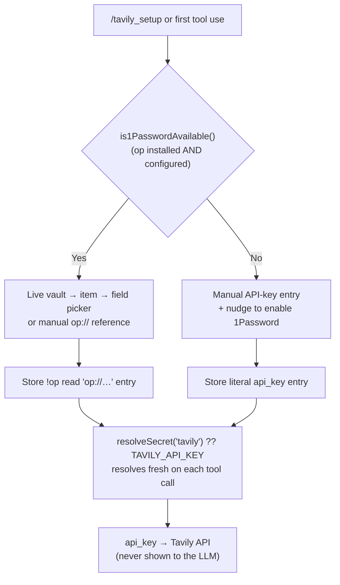

# @jmcombs/pi-tavily-search

A [Pi coding agent](https://pi.dev) extension that adds real-time web search via the
[Tavily API](https://tavily.com).

## Breaking changes in v3.0.0

- **`AuthStorage` is gone.** Pi 0.80.8 removed the `AuthStorage` API this extension used
  to store and read its API key. Credentials now resolve through the
  [`@jmcombs/pi-1password`](https://www.npmjs.com/package/@jmcombs/pi-1password)
  **credential API**, which this package now depends on directly and **installs
  automatically** — no separate install step.
- **Availability-branched onboarding.** When the `op` CLI is installed and an account is
  configured, setup opens a 1Password **vault → item → field picker**; when `op` is
  unavailable it falls back to **masked manual key entry**.
- **Existing keys keep working.** Any Tavily key already in `~/.pi/agent/auth.json` — a
  literal value or an `!op read` reference — resolves unchanged. No migration action is
  required.

## What's New — 1Password credential integration

Tavily search now handles your API key through the
[`@jmcombs/pi-1password`](https://www.npmjs.com/package/@jmcombs/pi-1password) credential
API, which installs automatically as a dependency. What this means for you:

- **Onboarding branches on 1Password availability.** If the `op` CLI is installed and an
  account is configured, `/tavily_setup` opens a live **vault → item → field
  picker** (or lets you type an `op://…` reference) and stores it as a `!op read '…'`
  entry that resolves fresh on every use. If `op` is not available, it falls back to
  **manual API-key entry** and nudges you to enable the 1Password extension for vault
  integration.
- **The `TAVILY_API_KEY` environment variable still works.** It remains a supported
  fallback, resolved after the stored `tavily` key.
- **Existing keys keep working.** Any Tavily key already in `~/.pi/agent/auth.json` — a
  literal key or an `!op read` reference — continues to resolve unchanged. No migration
  action is required.
- **The key is never exposed to the model.** Entry happens entirely in the TUI, and only
  the resolved value is used to call the Tavily API.
- **Enable 1Password for vault integration and startup unlock.** Install and enable the
  [`@jmcombs/pi-1password`](https://www.npmjs.com/package/@jmcombs/pi-1password) extension:
  it makes the vault picker available during onboarding and runs a one-time `op read` at
  session startup, so the biometric unlock prompt lands once.



## Install

```bash
# Globally (recommended)
pi install npm:@jmcombs/pi-tavily-search

# For a single session, without installing
pi -e npm:@jmcombs/pi-tavily-search
```

A Tavily API key is required. [Sign up at tavily.com](https://tavily.com) (free tier
available) to get one, then configure it using one of the methods below.

## What It Adds

- **Tool**: `tavily_search` — performs an advanced Tavily web search and returns up to
  five formatted results (title, URL, content) plus the raw API response under
  `details.raw`. The tool is callable by the LLM whenever it needs current
  information from the public web.
- **Command**: `/tavily_setup` — runs the `@jmcombs/pi-1password` onboarding flow
  to save (or update) your Tavily key. The input is never visible to the LLM.

## Configuration

The `tavily_search` tool resolves the key in this order:

1. `resolveSecret("tavily")` from `@jmcombs/pi-1password` — reads `~/.pi/agent/auth.json`
   fresh on each call (a literal key or an `!op read` reference). **Recommended.**
2. The `TAVILY_API_KEY` environment variable — fallback.

If neither is set, the tool automatically runs onboarding (the availability branch above)
on first use, then re-resolves — preserving the "prompt on first use" experience.

### Option 1 — `/tavily_setup` (recommended)

Run the command and follow the flow:

```
/tavily_setup
```

- When the `op` CLI is available, pick your key from the live vault picker (or paste an
  `op://vault/item/field` reference); it is stored as a `!op read '…'` entry that resolves
  fresh on every use.
- When `op` is not available, enter the key on a masked prompt; it is stored as a literal
  `api_key` entry.

Either way the value is written to `~/.pi/agent/auth.json` (`0600`) and never shown to the
model.

### Option 2 — edit `~/.pi/agent/auth.json` directly

The stored entry is provider-shaped under the `tavily` key. Any of these resolve:

#### Plain key

```json
{
  "tavily": {
    "type": "api_key",
    "key": "tvly-..."
  }
}
```

#### Shell-resolved key (1Password)

```json
{
  "tavily": {
    "type": "api_key",
    "key": "!op read 'op://Personal/tavily/credential'"
  }
}
```

#### Shell-resolved key (macOS Keychain / `pass`)

```json
{
  "tavily": {
    "type": "api_key",
    "key": "!security find-generic-password -ws tavily"
  }
}
```

The `!`-prefixed value is executed by your shell at lookup time, so no secret is
ever stored on disk in plaintext.

### Option 3 — environment variable

```bash
export TAVILY_API_KEY="tvly-..."
```

## Behavior Notes

- Search depth: `advanced`
- Max results returned: 5
- The tool honors Pi's abort signal — pressing **Esc** during a search cancels the
  HTTP request.
- If the API key is missing the tool returns an error result with a helpful
  configuration hint instead of throwing.
- Non-2xx responses from Tavily surface as tool errors (with status, status text,
  and response body) rather than throwing.

## Requirements

- Pi `>= 0.80.8` (credentials via the `@jmcombs/pi-1password` API and `ExtensionAPI`)
- Node `>= 22.0.0`
- A Tavily API key
- Optional: the `op` (1Password) CLI for vault-backed onboarding and startup unlock

## Development

This package lives in the [pi-extensions monorepo](https://github.com/jmcombs/pi-extensions).

```bash
# From the repo root
npm ci
npm run check       # full quality gate

# Try local changes against a real pi session
pi -e ./packages/tavily-search
```

The smoke test in `index.test.ts` does **not** mock the Tavily API; it only
verifies registration shape. Real end-to-end behavior is exercised via `pi -e`.

## License

[MIT](./LICENSE) © Jeremy Combs
